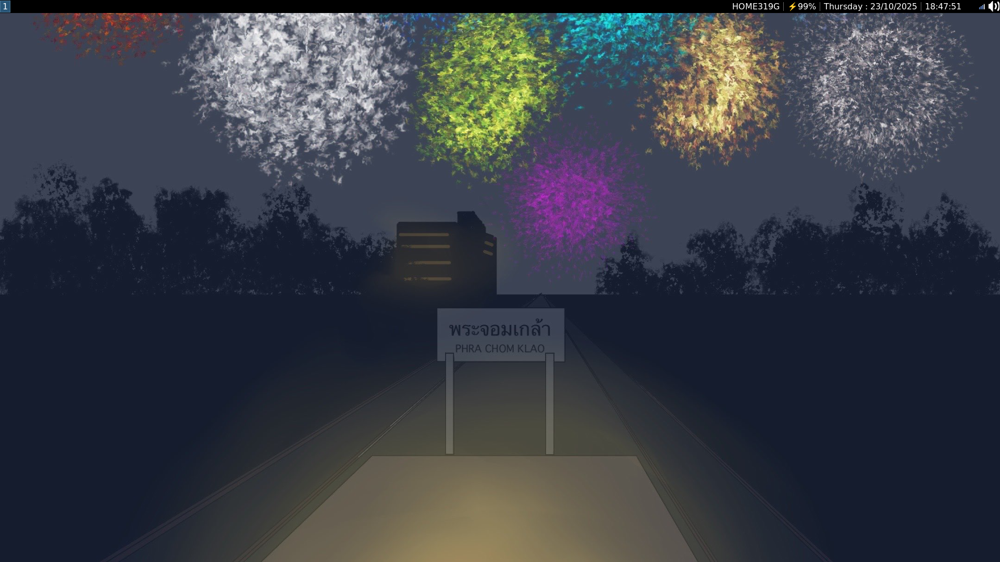

# Pottarr NixOS Configuration ❄️

## Preview



## Recommendation

- IdeaPad: For newer Laptop (comes with Dual-Boot)
- ThinkPad: For older laptop (comes with Fingerprint-scanner)

## How to install

### Git clone

- For SSH

```
git clone git@github.com:Pottarr/Pottarr-NixOS.git
```

- For HTTPS

```
git clone https://github.com/Pottarr/Pottarr-NixOS.git
```

### Remove hard-configuration.nix and use yours.

## Desktop Environment

Nah, I use `i3wm` as Window Manager.

## Teminal

- Emulator: `Alacritty`
- Multiplexer: `Tmux`
- Editor: `Neovim`
- TUI File Explorer: `Yazi`
- TUI Alternative of Postman: `Posting`

## Alias in ZSH

- `cd` $\rightarrow$ `z`
- `ls` $\rightarrow$ `eza --icons=always`
- `tree` $\rightarrow$ `eza -T --icons=always`
- `open` $\rightarrow$ `xdg-open`
- `cdd` $\rightarrow$ `zi`

## Script Provided

- `ELECOM` $\rightarrow$ Let [this](https://github.com/Pottarr/ELECOM_EX-G_Left_Handed_Mouse_Config_for_Linux) explain...  
- `screenshot` $\rightarrow$ No need to explain...  
(Inspiration: [Bread on Penguin](https://github.com/BreadOnPenguins/scripts))  
- `tmxs` $\rightarrow$ Tmux session manager written with pain as I was
trying to learn Shell Script  
(Inspiration: [Sylvan Franklin](https://github.com/SylvanFranklin/.config))
- `tmxd` (Still in development) $\rightarrow$ Tmux directory manager
also written in pain  
(Purpose: I don't want to exit and `tmux a -t SESSION_NAME -c DIRECTORY`.)
- Tmux internal scripts
    - `open_github` $\rightarrow$ Inspiration: [Sylvan Franklin](https://github.com/SylvanFranklin/.config)
    - `tmxs` $\rightarrow$ as mentioned earlier...
    - `tmxd` $\rightarrow$ as mentioned earlier...

## Shortcut Provided

- `Microsoft Team` $\rightarrow$ For real, it just open in Browser

## Wallpaper

- Drawn by me >W<

## User

- pottarr: You can change it, that's just my default one


