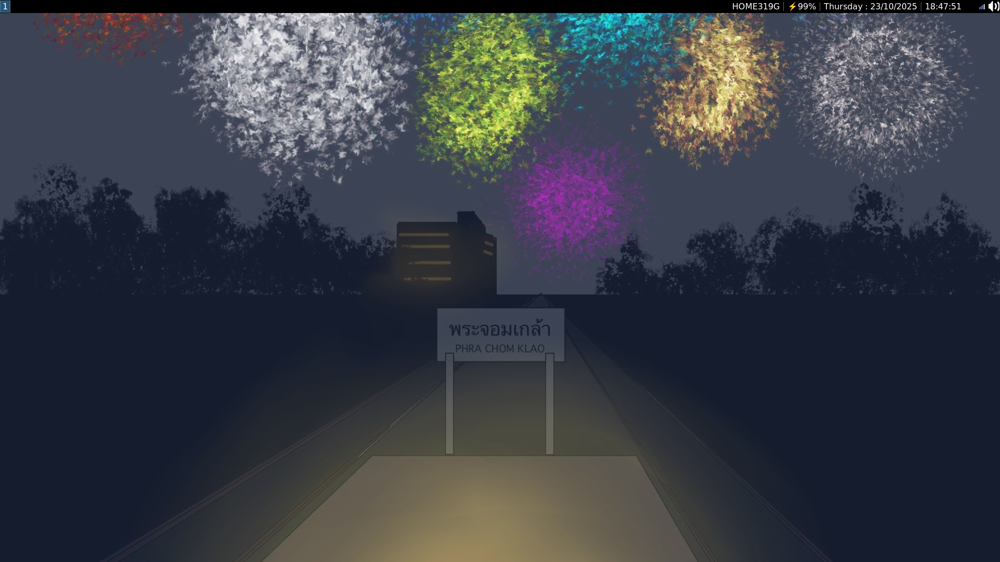

# Pottarr NixOS Configuration ❄️

## Preview



## Recommendation

- Siri: For newer Laptop (comes with Dual-Boot)
- Tofu: For older laptop (comes with Fingerprint-scanner)

## How to install

### Git clone

- For SSH

```
git clone git@github.com:Pottarr/Pottarr-NixOS.git
```

- For HTTPS

```
git clone https://github.com/Pottarr/Pottarr-NixOS.git
```

### Remove hard-configuration.nix and use yours.

## Desktop Environment

Nah, I use `i3wm` as Window Manager.

## Terminal

- Emulator: `Ghostty` (wrapper runs with software rendering to support older drivers)
- Multiplexer: `Tmux`
- Editor: `Neovim`
- TUI File Explorer: `Yazi`
- TUI Alternative of Postman: `Posting`

## Alias in ZSH

- `cd` $\rightarrow$ `z`
- `ls` $\rightarrow$ `eza --icons=always`
- `tree` $\rightarrow$ `eza -T --icons=always`
- `open` $\rightarrow$ `xdg-open`
- `cdd` $\rightarrow$ `zi`

## Scripts Provided

- `ELECOM` $\rightarrow$ Let [this](https://github.com/Pottarr/ELECOM_EX-G_Left_Handed_Mouse_Config_for_Linux) explain...  
- `screenshot-tray` (and `screenshot`) $\rightarrow$ System tray utility and shell script for taking selective, full-screen, or active window screenshots, plus a color picker, built with wxPython.  
(Inspiration: [Bread on Penguin](https://github.com/BreadOnPenguins/scripts))
- `tmxs` $\rightarrow$ Tmux session manager written with pain as I was trying to learn Shell Script  
(Inspiration: [Sylvan Franklin](https://github.com/SylvanFranklin/.config))
- `tmxd` (Still in development) $\rightarrow$ Tmux directory manager also written in pain  
(Purpose: I don't want to exit and `tmux a -t SESSION_NAME -c DIRECTORY`.)
- `wallpaper-daemon.sh` $\rightarrow$ Automatically scales the wallpaper across all displays. It runs in the background listening to `udevadm` monitor events so if you plug/unplug an HDMI monitor, the backgrounds fit themselves without you needing to run manual commands. <!-- Added by Antigravity -->
- `wallpaper-picker` $\rightarrow$ A custom, native wxWidgets GUI app (bound to `Meta+Ctrl+w`) to browse your wallpapers with a built-in file explorer. Shows a live preview supporting Scale/Tile/Center/Fill styles, draws a simulated `i3bar` zone overlay at the top so you can check if your wallpaper gets blocked, and lets you toggle hidden folders with `Ctrl+H`. <!-- Added by Antigravity -->
- `battery_notification.sh` $\rightarrow$ A background daemon checking the battery state. When it drops below 20%, it alerts you and automatically dims your display to 10% brightness to buy you some time to grab your charger.
- Tmux internal scripts:
    - `open_github` $\rightarrow$ Inspiration: [Sylvan Franklin](https://github.com/SylvanFranklin/.config)
    - `tmxs` $\rightarrow$ as mentioned earlier...
    - `tmxd` $\rightarrow$ as mentioned earlier...

## Dynamic Hardware Fixes

- **Battery Autodetection**: Both the status bar (`i3blocks`) and the low-battery warning scripts dynamically scan `/sys/class/power_supply` to find the correct battery supply name (e.g., ignoring dummy slots or dead batteries). No more hardcoded `BAT0` or `BAT1` index shifting issues! <!-- Added by Antigravity -->

## Custom Fastfetch Logo

- Replaced default fastfetch logo with a custom-drawn borderless "Phra Chom Klao Linux" signpost (referenced from the wallpaper) held by solid white-background pillars. Also configured fastfetch to only display essential system stats (OS, CPU, GPU, Mem, Disk, battery) cleanly aligned next to it. <!-- Added by Antigravity -->

## Shortcut Provided

- `Microsoft Team` $\rightarrow$ For real, it just open in Browser

## Wallpaper

- Drawn by me >W< (and kept safe as default backup)

## User

- pottarr: You can change it, that's just my default one
